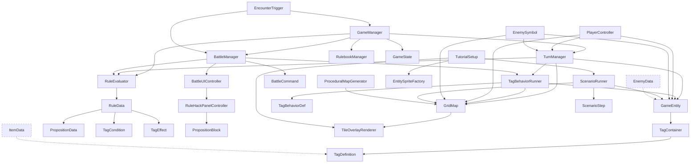

# Flip Logic — アーキテクチャ現状分析と改善提案

> コードベース全26スクリプト (2026-03-21時点) から読み取った **現行実装の仕様整理** と、  
> よりシステマチック・スケーラブルにするための **改善提案** を記す。

---

## 目次

1. [ターン制処理機構](#1-ターン制処理機構)
2. [タグシステム](#2-タグシステム)
3. [ルール改変（Rule Hack）機構](#3-ルール改変rule-hack機構)
4. [敵・プレイヤー・ステージ仕様](#4-敵プレイヤーステージ仕様)
5. [ビジュアル関連仕様](#5-ビジュアル関連仕様)
6. [改善提案：システム設計](#6-改善提案システム設計)
7. [改善提案：デザイナーパネル](#7-改善提案デザイナーパネル)

---

## 1. ターン制処理機構

### 1.1 現状（TurnManager.cs）

同期型ターン進行。`OnPlayerAction()` 1回呼び出しで 1ターンが完結する。

```
WaitingForInput
  → PlayerAction   : OnTurnStart / OnPlayerActionComplete 発火
  → EnemyAction    : OnEnemyPhase 発火 → 各 EnemySymbol が AI 行動
  → RuleEvaluation : RuleEvaluator.EvaluateAll() → TagBehaviorRunner.ExecuteTurnEndBehaviors()
  → TagTick        : 全 GameEntity / 全 GridMap セルの TagContainer.TickDurations()
  → WaitingForInput : OnTurnEnd 発火
```

**バトル時は別系統** — `BattleManager.DoTurnEnd()` が独自にルール評価→タグ Tick を実行する（TurnManager を経由しない）。

### 1.2 問題点

| # | 問題 | 影響 |
|---|------|------|
| 1 | フィールドとバトルでターン進行が二重実装 | ルール追加時に2箇所修正が必要 |
| 2 | フェーズ進行が完全同期（async/コルーチン未使用）| 演出の挟み込み困難 |
| 3 | TurnPhase が固定 enum | フェーズ追加（アイテム使用フェーズ等）が enum 修正を強制 |
| 4 | イベント購読がバラバラ（Start/OnDestroy直書き） | 解除漏れリスク |

---

## 2. タグシステム

### 2.1 データモデル

```
TagDefinition (struct)
  ├── Key      : string  （"Element", "Status", "Damage", "Terrain", "EncounterMsg"）
  ├── Value    : string  （"Fire", "Ice", "Poison", "InstantDeath", "Defending", "Physical", "Wall"）
  ├── Duration : int     （0 = 永続、正数 = 残りターン）
  ├── Source   : string  （発生源トレーサビリティ用）
  └── BehaviorId : string （TagBehaviorDef への参照 ID）

TagContainer (class, Serializable)
  ├── AddTag / RemoveTag / HasTag / HasKey / GetValue / GetAllByKey
  ├── TickDurations()  → 非永続タグを毎ターン減算、0 で除去
  └── OnTagsChanged event
```

### 2.2 現在使われているタグ一覧

| Key | Value | 用途 | 付与先 |
|-----|-------|------|--------|
| `Element` | `Fire` | 火マス / 火属性 | セル |
| `Element` | `Ice` | 氷属性（スライム等） | エンティティ |
| `Element` | `Poison` | 毒属性 | セル |
| `Terrain` | `Wall` | 通行不可判定 | セル |
| `Damage` | `Physical` | 物理ダメージ発生(1T) | エンティティ |
| `Status` | `Defending` | 防御中(1T) | エンティティ |
| `Status` | `InstantDeath` | 即死(1T) | エンティティ |
| `EncounterMsg` | 任意テキスト | エンカウント時メッセージ | エンティティ |

### 2.3 絶対法則（TagBehaviorDef / TagBehaviorRunner）

**現状登録済みの法則は1つだけ:**

| BehaviorId | Effect | Trigger | 内容 |
|------------|--------|---------|------|
| `InstantDeath` | `SetHpZero` | `TurnEnd` | HP を 0 にする |

`TagBehaviorType` enum には `DealDamage`, `Heal`, `AddTag`, `RemoveTag`, `ClearStatus` も定義されているが、`ApplyEffect()` の switch 文では **`SetHpZero` しか実装されていない**。

### 2.4 問題点

| # | 問題 | 影響 |
|---|------|------|
| 1 | Key/Value が全てマジック文字列 | タイプミスで無音失敗 |
| 2 | TagBehaviorType の大半が未実装 | 拡張性が絵に描いた餅 |
| 3 | タグのカテゴリ分類がない | Element と Status が同列で可読性低 |
| 4 | TagBehaviorDef がハードコード登録のみ | デザイナーが追加不可 |
| 5 | Duration=0 が「永続」を意味する設計 | -1=永続, 0=即時消滅 のほうが直感的 |

---

## 3. ルール改変（Rule Hack）機構

### 3.1 データモデル（PropositionData.cs 内）

```
RuleData
  ├── RuleId, RuleName, Description, Chapter, IsActive
  ├── Condition : PropositionData  （P: 肯定文 / 否定文テキスト + IsNegated）
  ├── Result    : PropositionData  （Q: 同上）
  ├── IsSwapped : bool             （P↔Q 入替フラグ）
  ├── SubjectFilterP : TagCondition（このルールが適用されるエンティティ条件）
  ├── TagConditionP  : TagCondition（条件 P のタグ判定）
  └── TagResultQ     : TagEffect   （帰結 Q のタグ操作）
```

### 3.2 論理操作

プレイヤーができる操作は **3つ**:

1. **否定トグル** — P または Q の `IsNegated` を反転
2. **入替（Swap）** — P↔Q の位置を入替
3. **リセット** — 元の状態に戻す

これにより **8つの LogicState** が生成される:

| LogicState | 表記 |
|------------|------|
| Original | P→Q |
| Converse | Q→P |
| Inverse | ¬P→¬Q |
| Contrapositive | ¬Q→¬P |
| PNegatedOnly | ¬P→Q |
| QNegatedOnly | P→¬Q |
| SwappedPNeg | ¬Q→P |
| SwappedQNeg | Q→¬P |

### 3.3 評価エンジン（RuleEvaluator.cs）

```
毎ターン末:
  for rule in activeRules:
    if !rule.IsActive: skip
    for entity in allEntities:
      if SubjectFilterP != null && !SubjectFilterP.Evaluate(entity): skip
      conditionTags = GetTargetTags(entity, condition.Target)  // Entity or TileOfEntity
      if condition.Evaluate(conditionTags, negated):
        effectTags = GetTargetTags(entity, effect.Target)
        effect.Apply(effectTags, resultNegated, source)
```

**特殊ハック**: `Status:InstantDeath` 条件は、タグだけでなく `!entity.IsAlive` でも成立する（L99-105）。

### 3.4 ルールブック管理（RulebookManager.cs）

- **章（Chapter）** 単位でルールをグループ化
- `UnlockChapter(n)` で n 以下の章のルールをアクティブ化
- 現状、ルールは **GameManager.SetupTestRules() でハードコード定義** のみ

### 3.5 問題点

| # | 問題 | 影響 |
|---|------|------|
| 1 | ルール定義が全てコード直書き | デザイナーがルールを作れない |
| 2 | RuleData が ScriptableObject でない | Inspector での編集・アセット管理不可 |
| 3 | PropositionData のテキストがルール動作と分離 | テキスト変更が動作に影響しないのに紛らわしい |
| 4 | スワップ時の Condition↔Effect 変換がロジカルに脆い | ConvertEffectToCondition が単純な RequirePresence 反転のみ |
| 5 | RulebookManager が MonoBehaviour でない | ライフサイクル管理が不透明 |
| 6 | 1バトルにつきルール改変1回の制限がハードコード | 難易度調整が困難 |

---

## 4. 敵・プレイヤー・ステージ仕様

### 4.1 エンティティ統一基底（GameEntity.cs）

全エンティティが共有する属性:

| フィールド | 用途 |
|-----------|------|
| `EntityName` | 識別名（文字列ベース） |
| `EntityType` | `Player / Enemy / Npc / Object / Terrain` |
| `GridPosition` | Vector2Int 座標 |
| `TagContainer` | 全タグ |
| `Hp / MaxHp / Attack / Defense` | 戦闘ステータス |

### 4.2 敵仕様

**EnemyData (ScriptableObject):**
- 基本情報: EnemyName, Description, Portrait
- ステータス: MaxHp, Attack, Defense
- 初期タグ: `List<TagDefinition>`
- AI: `EnemyAIType` (Stationary / Patrol / Chase)
- 関連ルール: `RelatedRuleId`
- 演出: EncounterMessage, DefeatMessage

**EnemySymbol (MonoBehaviour):**
- `TurnManager.OnEnemyPhase` に登録し、ターンごとにAI行動
- AIType で分岐: Stationary（動かない）, Patrol（左右往復）, Chase（プレイヤー追跡）
- Chase は `_detectRange`（マンハッタン距離）内でのみ追跡

**問題**: EnemyData (SO) は定義されているが、**実際にはスクリプト内で直接 Initialize() を呼んでおり、EnemyData SO を参照するファクトリが存在しない**。

### 4.3 プレイヤー仕様

**PlayerController (MonoBehaviour):**
- 矢印キー / WASD で 1マスずつ移動
- 移動 = 1ターン消費 (`TurnManager.OnPlayerAction()`)
- バトル中 / シナリオブロック中は移動不可
- 移動アニメーション（MoveTowards、速度 `_moveAnimSpeed`）

### 4.4 ステージ仕様

**GridMap (MonoBehaviour):**
- 各セルのタグ情報 (`Dictionary<Vector2Int, TagContainer>`)
- エンティティ位置追跡 (`Dictionary<Vector2Int, List<GameEntity>>`)
- Tilemap 参照（ground / wall / overlay）— 但し現状 SpriteRenderer ベースで運用
- 通行判定: Wall Tilemap のタイル有無 + `Terrain:Wall` タグ

**ProceduralMapGenerator:**
- 矩形マップ生成（外周壁 + 固定トップブロック）
- SpriteRenderer で白テクスチャに色付け
- 本番用マップロード機構なし

### 4.5 エンカウント（EncounterTrigger.cs）

- プレイヤーの `OnPlayerActionComplete` で隣接4マス + 同一マスの敵を検索
- マンハッタン距離 ≤ 1 で `BattleManager.StartBattle()` を呼ぶ
- **ルール選択がハードコード**: `GetActiveRules()[0]` を渡すだけ

### 4.6 問題点

| # | 問題 | 影響 |
|---|------|------|
| 1 | EnemyData (SO) が実質未使用 | アセットベースの敵管理が機能していない |
| 2 | マップ生成が Tutorial 専用のハードコード | 汎用ステージ生成/ロードなし |
| 3 | エンティティ検索が毎回 FindObjectsByType | パフォーマンス非効率 |
| 4 | EntityType.Terrain が GameEntity だが HP/Attack を持つ | 不要フィールド |
| 5 | エンカウント時のルール選択が [0] 固定 | 敵ごとのルール紐付けが動作しない |

---

## 5. ビジュアル関連仕様

### 5.1 エンティティの見た目

**EntitySpriteFactory** — 動的テクスチャ生成:
- 64×64 の円 + 中央にビットマップ文字（P/E のみ対応）
- プレイヤー: 青丸＋白 "P"
- 敵: 水色丸＋白 "E"

**問題**: `GetLetterBitmap()` が P/E のみ。NPC/Object/新敵種はスプライトなし。

### 5.2 マスの見た目

**ProceduralMapGenerator** — SpriteRenderer ベース:
- 床: 暗緑 `(0.22, 0.35, 0.22)`
- 壁: 暗茶 `(0.15, 0.12, 0.10)`

**TileOverlayRenderer** — タグ視覚化:
- Fire: オレンジ `(1, 0.55, 0.10, 0.6)` の斜め交差格子パターン
- Poison: 紫 `(0.6, 0.15, 0.8, 0.6)` の同パターン
- Ice: 水色 `(0.4, 0.8, 1.0, 0.6)` の同パターン
- SortingOrder: -5

**問題**: 色マッピングがハードコード。新属性追加時にスクリプト修正必須。

### 5.3 バトルUI

**BattleUIGenerator** — 完全コード生成:
- Canvas (960×540, ScreenSpaceOverlay)
- MessagePanel, CommandPanel (たたかう/ぼうぎょ/ルールブック/にげる), HpPanel, RuleHackPanel
- 全て `Image` + `Text` (Legacy UI) をコードで new
- SerializeField への注入は **リフレクション** で実行

**RuleHackPanel:**
- ConditionBlock / ResultBlock（PropositionBlock: テキスト＋否定ボタン）
- 接続詞テキスト「ならば」
- Swap/Reset/Confirm ボタン
- 論理状態表示、命題プレビュー

### 5.4 シナリオUI

- TutorialSetup が Canvas + メッセージパネルをコード生成
- ScenarioRunner に リフレクション でUI注入

### 5.5 問題点

| # | 問題 | 影響 |
|---|------|------|
| 1 | UI が全てコード生成＋リフレクション注入 | デザイナーがレイアウト調整不可 |
| 2 | Legacy Text (UnityEngine.UI.Text) 使用 | TextMeshPro 移行時に全ファイル修正 |
| 3 | スプライト生成が P/E の2文字のみ | エンティティ種類が増やせない |
| 4 | 属性色がハードコード | データ駆動でない |
| 5 | バトルUIの色・サイズが定数 | テーマ変更困難 |

---

## 6. 改善提案：システム設計

### 6.1 ターン制処理

```
[提案] Phase Pipeline パターンの導入

IPhaseHandler インターフェース:
  - Execute(TurnContext ctx) : UniTask
  - Priority : int

TurnManager:
  - List<IPhaseHandler> をソート済みで保持
  - OnPlayerAction() → foreach handler in handlers: await handler.Execute(ctx)
  - フィールド/バトルの差分は handler の登録差で吸収

利点:
  - フェーズ追加が IPhaseHandler 実装の追加だけ
  - async/await で演出の挟み込みが自然
  - バトルとフィールドでターン処理を統一可能
```

### 6.2 タグシステム

```
[提案] タグキー/値の型安全化 + ScriptableObject 辞書

TagKeyRegistry (ScriptableObject):
  - 全タグキーの定義（Element, Status, Terrain, Damage）
  - 各キーに許容される値のリスト
  - 各値に対する TagBehaviorDef の参照

TagDefinition:
  - Duration: -1 = 永続、0 = 即時消滅、正数 = 残りターン（意味の明確化）
  - Key/Value を TagKey/TagValue enum または SO 参照に変更

TagBehaviorRunner:
  - ApplyEffect() の全 TagBehaviorType を実装
  - TagBehaviorDef を ScriptableObject 化してデータ駆動に

利点:
  - マジック文字列の根絶
  - デザイナーが Inspector で新タグ/振る舞いを定義可能
  - バリデーション可能（存在しないキー/値の検出）
```

### 6.3 ルール改変

```
[提案] RuleData の ScriptableObject 化

RuleDataAsset (ScriptableObject):
  - 現行 RuleData の全フィールドを保持
  - Inspector で条件/結果のタグ操作を GUI 編集
  - ランタイム状態（IsSwapped, IsNegated）は別の RuntimeRuleState クラスで管理
    → アセットのイミュータブル性を担保

RulebookAsset (ScriptableObject):
  - List<RuleDataAsset> Rules
  - int Chapter
  - string Title, Description

利点:
  - ステージごとに異なるルールセットをアセットで管理
  - デザイナーがコード不要でルールを作成・調整
  - プレイテスト中のホットリロード的な調整が可能
```

### 6.4 敵・ステージ

```
[提案] EnemyData → GameEntity 適用のファクトリパターン

EntityFactory:
  - CreateFromData(EnemyData data, Vector2Int pos) → GameEntity
  - 初期タグ、ステータス、スプライト、AI全てをデータから構築

StageData (ScriptableObject):
  - マップサイズ
  - 壁配置: List<Vector2Int> walls
  - 初期セルタグ: List<(Vector2Int, TagDefinition)> tileTags
  - 敵配置: List<(EnemyData, Vector2Int)> enemies
  - ルール: List<RuleDataAsset> rules
  - シナリオ: ScenarioAsset (後述)

StageLoader:
  - StageData を受け取り、GridMap/Entity/Rule を一括構築

利点:
  - ステージがアセット1つで完結
  - デザイナーがステージを量産可能
  - テスト用ステージの切替が容易
```

### 6.5 ビジュアル

```
[提案] 見た目定義のデータ駆動化

EntityVisualDef (ScriptableObject):
  - Sprite (静的スプライト or アニメーション参照)
  - Color tint
  - SortingLayer, OrderInLayer
  - Scale
  → EntitySpriteFactory のビットマップ生成を置換

TileVisualDef (ScriptableObject):
  - タグキー/値 → (Color, PatternType, Sprite) のマッピング
  - PatternType: Crosshatch / Dots / Solid / Custom
  → TileOverlayRenderer のハードコード色を置換

UITheme (ScriptableObject):
  - バトル/ルールハックUIの色テーマ
  - フォント設定（TextMeshPro 前提）
  → BattleUIGenerator の定数を置換

利点:
  - 属性追加時にコード変更なし
  - アーティストがビジュアルを調整可能
  - UI Toolkit / TextMeshPro 移行の土台
```

### 6.6 エンティティ管理

```
[提案] ServiceLocator + 登録制へ移行

EntityRegistry (MonoBehaviour, singleton):
  - Dictionary<int, GameEntity> で全エンティティを管理
  - GameEntity.OnEnable/OnDisable で自動登録/解除
  - FindObjectsByType の毎フレーム呼び出しを根絶

  - GetByType(EntityType) : IReadOnlyList<GameEntity>
  - GetByTag(string key, string value) : IReadOnlyList<GameEntity>
  - GetByPosition(Vector2Int) : IReadOnlyList<GameEntity>
    → GridMap._entityMap と統合

利点:
  - O(1) のエンティティ検索
  - GC Alloc 削減
  - WebGL でのパフォーマンス改善
```

---

## 7. 改善提案：デザイナーパネル

### 7.1 概要

Unity Editor 上にカスタムウィンドウ（EditorWindow）を提供し、ゲームデザイナーが **コード変更なし** でコンテンツを作成・調整できるようにする。

### 7.2 パネル構成案

```
FlipLogic Designer  [Editor Window]
├── 📋 Stage Editor
│   ├── マップサイズ設定 (幅×高さ)
│   ├── グリッドビジュアルエディタ（壁/床のペイント）
│   ├── タイルタグ付与（セル選択 → Element:Fire 等）
│   ├── 敵配置（EnemyData SOドラッグ → マス指定）
│   └── ステージエクスポート（→ StageData SO 生成）
│
├── ⚔️ Enemy Editor
│   ├── EnemyData SO の一覧・新規作成
│   ├── ステータス調整スライダー（HP/ATK/DEF）
│   ├── 初期タグ編集（KeyRegistry からドロップダウン選択）
│   ├── AI タイプ選択
│   └── 関連ルール紐付け
│
├── 📖 Rule Editor
│   ├── RuleData SO の一覧・新規作成
│   ├── 条件/帰結のタグ条件を GUI で構成
│   │   ├── Target (Entity / TileOfEntity)
│   │   ├── Key (ドロップダウン)
│   │   ├── Value (ドロップダウン)
│   │   └── RequirePresence / Operation
│   ├── 命題テキスト (肯定形/否定形) の入力
│   ├── 8つの LogicState プレビュー
│   └── テストボタン（指定エンティティに対してルール適用をシミュレート）
│
├── 🏷️ Tag Registry
│   ├── 全タグキーの一覧管理
│   ├── キーごとの許容値リスト
│   ├── 各タグの TagBehaviorDef 紐付け
│   └── ビジュアル定義（色、パターン）の設定
│
├── 📜 Scenario Editor
│   ├── ScenarioStep のリスト編集
│   ├── トリガー/アクションをドロップダウンで選択
│   ├── パラメータの入力支援（エンティティ名補完、座標ピッカー）
│   └── シナリオ JSON/SO エクスポート
│
└── 🎮 Play Test
    ├── ステージ即時ロード＆プレイ
    ├── リアルタイムタグインスペクター（選択エンティティの全タグ表示）
    ├── ルール評価ログビューアー
    └── ターン手動進行ボタン
```

### 7.3 実装優先度

| 優先度 | パネル | 理由 |
|--------|--------|------|
| **P0** | Tag Registry | 全ての基盤。マジック文字列を排除する出発点 |
| **P0** | Rule Editor | ゲームの核心機構。コード直書きの解消が急務 |
| **P1** | Enemy Editor | EnemyData SO は既に存在。ファクトリの追加で活用可能に |
| **P1** | Stage Editor | ステージ量産に直結 |
| **P2** | Scenario Editor | シナリオのコード直書きの解消 |
| **P2** | Play Test | デバッグ効率の向上 |

### 7.4 技術選択

| 要素 | 推奨 | 理由 |
|------|------|------|
| UI | UI Toolkit (UXML/USS) | EditorWindow での標準。VisualElement ベースで柔軟 |
| データ | ScriptableObject | Inspector連携・アセット管理・シリアライズが自然 |
| グリッドエディタ | IMGUI (GUILayout) + HandleUtility | タイルペイントのカスタムエディタに適切 |
| テスト | EditorWindow 内の Play ボタン | EditorApplication.EnterPlaymode を利用 |

---

## 付録：クラス依存関係



> 点線: 定義は存在するが実際の参照パスが構築されていないもの

---

## 付録：ファイル一覧

| ディレクトリ | ファイル | 行数 | 役割 |
|-------------|----------|------|------|
| Core | `GameManager.cs` | 120 | 統括マネージャー |
| Core | `TurnManager.cs` | 120 | ターン進行 |
| Core | `GameEntity.cs` | 140 | エンティティ基底 |
| Core | `GameState.cs` | 66 | ゲーム進行状態 |
| Core | `TagContainer.cs` | 164 | タグ集合管理 |
| Core | `TagDefinition.cs` | 65 | タグデータ構造 |
| Core | `TagBehaviorDef.cs` | 57 | タグ振る舞い定義 |
| Core | `TagBehaviorRunner.cs` | 122 | 絶対法則エンジン |
| Core | `EntitySpriteFactory.cs` | 115 | 動的スプライト生成 |
| Core | `CameraFollow.cs` | 28 | カメラ追従 |
| Battle | `BattleManager.cs` | 305 | バトル進行管理 |
| Battle | `BattleCommand.cs` | 87 | コマンド実行 |
| Battle | `BattleUIController.cs` | 123 | バトルUI制御 |
| Battle | `BattleUIGenerator.cs` | 312 | バトルUI動的生成 |
| Battle | `RuleHackPanelController.cs` | 106 | ルール改変UI制御 |
| Logic | `RuleEvaluator.cs` | 180 | ルール一斉評価エンジン |
| Logic | `LogicEvaluator.cs` | 60 | 論理状態判定ユーティリティ |
| Data | `PropositionData.cs` | 238 | ルール/命題/タグ条件/タグ効果 |
| Data | `EnemyData.cs` | 42 | 敵データ (SO) |
| Data | `ItemData.cs` | 45 | アイテムデータ (SO) |
| Grid | `GridMap.cs` | 166 | グリッドマップ管理 |
| Grid | `TileOverlayRenderer.cs` | 165 | タイルオーバーレイ描画 |
| Rulebook | `RulebookManager.cs` | 99 | ルールブック管理 |
| Scenario | `ScenarioRunner.cs` | 291 | シナリオ実行エンジン |
| Scenario | `ScenarioStep.cs` | 65 | シナリオステップ定義 |
| Explore | `PlayerController.cs` | 104 | プレイヤー移動制御 |
| Explore | `EnemySymbol.cs` | 151 | フィールド敵シンボル |
| Explore | `EncounterTrigger.cs` | 56 | エンカウント判定 |
| Tutorial | `TutorialSetup.cs` | 251 | チュートリアルセットアップ |
| Tutorial | `ProceduralMapGenerator.cs` | 108 | プロシージャルマップ生成 |
| UI | `PropositionBlock.cs` | 77 | 命題ブロックUI |
| UI | `DraggablePart.cs` | 142 | ドラッグ可能パーツ |
| UI | `DropSlot.cs` | 75 | ドロップスロット |
